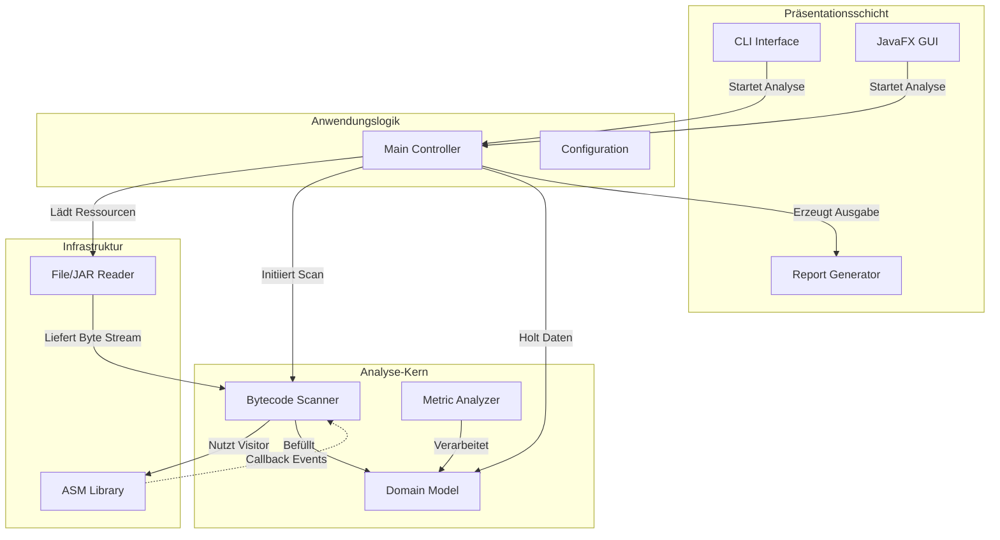

# 4. Software-Architektur

## 4.1 Architektur-Übersicht

JByteInspector folgt einer modularen **Schichtenarchitektur**, um die Verantwortlichkeiten zwischen Eingabeverarbeitung, Bytecode-Analyse und Ergebnisdarstellung klar zu trennen. Dies gewährleistet Wartbarkeit und Erweiterbarkeit (z.B. das spätere Hinzufügen einer GUI).

### Komponenten-Diagramm

## 4.2 Kern-Komponenten

### 1. Input Handler (Infrastruktur)
Verantwortlich für das Einlesen der Rohdaten.
- Abstrahiert den Zugriff auf das Dateisystem.
- Kann einzelne `.class`-Dateien lesen.
- Iteriert rekursiv durch Verzeichnisse.
- Öffnet und liest `.jar`-Archive (via `ZipInputStream`).

### 2. Analysis Core (Domain Layer)
Das Herzstück der Anwendung. Hier findet das Parsing des Bytecodes statt.
- **Technologie:** ASM Framework.
- **Pattern:** **Visitor Pattern**.
    - `ClassVisitor`: Besucht die Metadaten einer Klasse (Name, Superklasse, Interfaces).
    - `MethodVisitor`: Besucht den Code innerhalb von Methoden (Instruktionen, Methodenaufrufe).
- **Scanner:** Der Scanner implementiert die Visitor-Interfaces und extrahiert selektiv die für die Analyse relevanten Informationen in das Domain Model.

### 3. Domain Model
Datenklassen (POJOs/Records), die die extrahierten Informationen repräsentieren, z.B.:
- `ClassInfo` (Name, Version, Superklasse)
- `MethodInfo` (Signatur, Access Flags)
- `OpcodeStats` (Map von Opcode -> Anzahl)
- `CallGraph` (Knoten und Kanten der Methodenaufrufe)

### 4. UI & Reporting
- **CLI:** Verarbeitet Kommandozeilenargumente (via Bibliotheken wie Picocli oder Apache Commons CLI) und gibt textbasierte Tabellen aus.
- **Report Generator:** Formatiert die Daten aus dem Model in lesbare Formate (Text, CSV, JSON).

## 4.3 Design Patterns

### Visitor Pattern (Zentral)
Da die Struktur von Java-Bytecode komplex und hierarchisch ist, eignet sich das Visitor Pattern ideal. Anstatt durch einen komplexen Objektbaum zu navigieren, "reagiert" der Analyzer auf Events während des Parsens.
*Beispiel:* Wenn ASM den Opcode `INVOKEVIRTUAL` im Bytecode findet, ruft es die Methode `visitMethodInsn(...)` unseres `MethodVisitors` auf. Wir müssen nur diese Methode implementieren, um den Methodenaufruf zu protokollieren.

### Data Transfer Object (DTO)
Das Domain Model dient als DTO, um die Analysedaten entkoppelt von der ASM-Logik an die UI weiterzureichen. Das stellt sicher, dass die UI keine Abhängigkeit zur Bytecode-Bibliothek hat.
