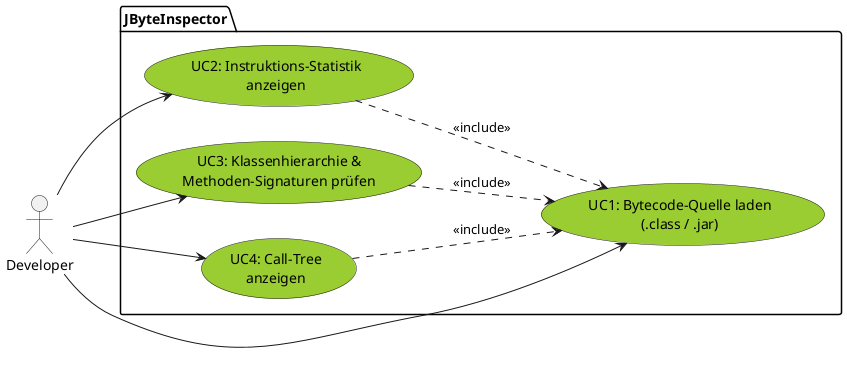
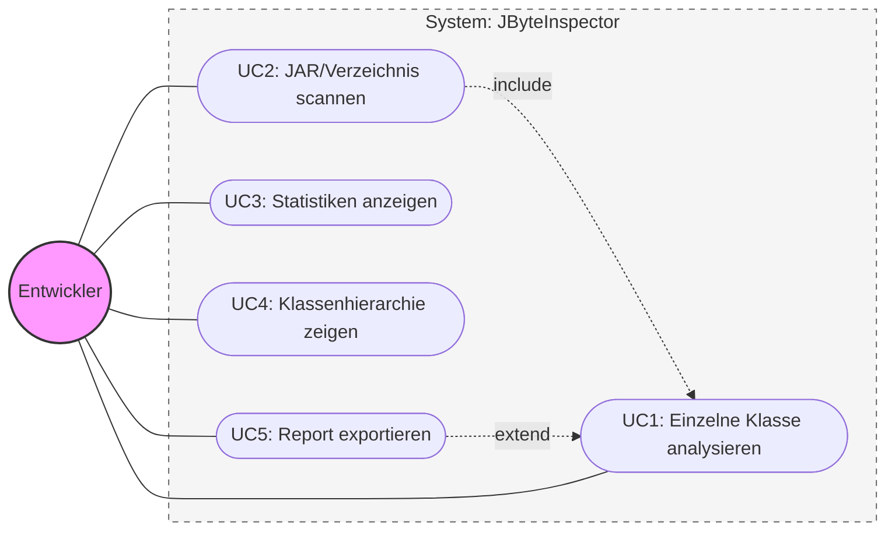
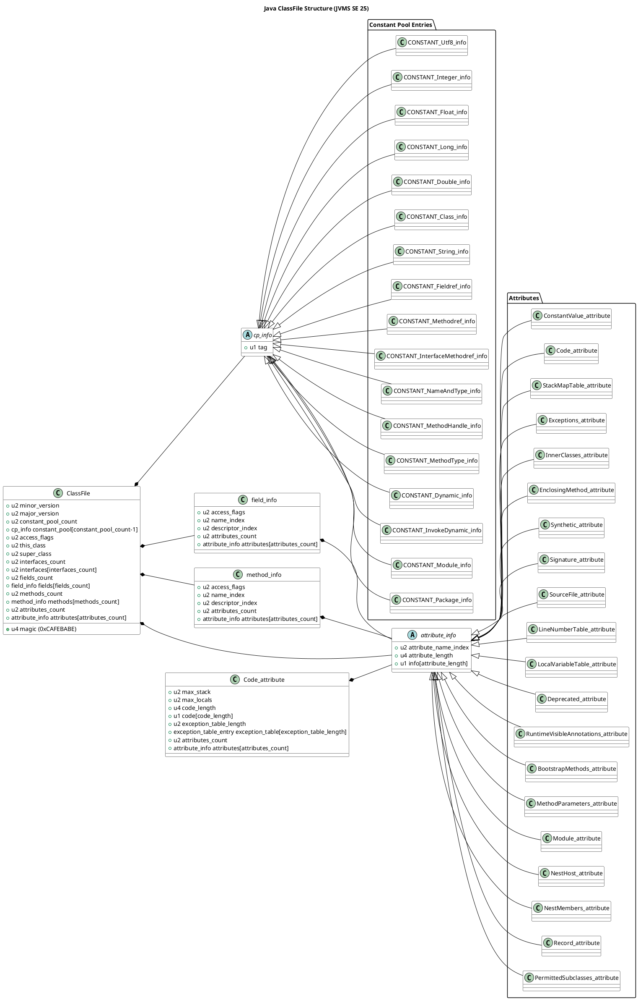

# Projektantrag: JByteInspector

## 1. Projektbezeichnung

**Entwicklung eines Java-Bytecode-Analyzers zur statischen Untersuchung von Klassenhierarchien und Instruktionsmetriken.**

## 2. Projektbeschreibung

**Ausgangslage:**

Nach der Kompilierung von Java-Quellcode liegt dieser als Bytecode in `.class`-Dateien vor. Für Entwickler ist es oft schwer nachzuvollziehen, wie der Java-Compiler (javac) Optimierungen vornimmt oder welche Abhängigkeiten auf Bytecode-Ebene tatsächlich bestehen. Bestehende Tools wie `javap` sind oft rein textbasiert und für schnelle, statistische Auswertungen unhandlich.
*Siehe detaillierte [[Ist-Analyse]].*

**Zielsetzung:**

Ziel des Projekts ist die Entwicklung der Java-Anwendung **JByteInspector**. Diese soll `.class`-Dateien automatisiert einlesen, deren interne Struktur analysieren und die gewonnenen Informationen (wie Klassenhierarchien, Methodensignaturen und Instruktionsstatistiken) übersichtlich aufbereiten. Das Tool soll Entwicklern helfen, die Komplexität und den Aufbau von kompilierten Klassen effizient zu verstehen.
*Siehe [[Soll-Konzept]] und [[diagrams/Use Cases & User Stories|Use Cases & User Stories]].*

## 3. Zeitplanung (100 Stunden)

| **Phase**              | **Aufgabe**                                                            | **Stunden** | **Summe** |
| ---------------------- | ---------------------------------------------------------------------- | ----------- | --------- |
| **1. Analyse**         | [[Ist-Analyse]], Problemstellung                                       | 3h          | **8h**    |
|                        | Technologie-Recherche & Auswahl ([[Opcodes]])                          | 5h          |           |
| **2. Entwurf**         | Architekturdesign ([[Architektur]]) & [[Soll-Konzept]]                 | 6h          | **14h**   |
|                        | Klassendiagramme & [[diagrams/Use Cases & User Stories\|User Stories]] | 8h          |           |
| **3. Implementierung** | Projekt-Setup & Basis-Infrastruktur                                    | 5h          | **58h**   |
|                        | Kern-Entwicklung (Bytecode-Parsing)                                    | 18h         |           |
|                        | Implementierung der Analyse-Algorithmen                                | 15h         |           |
|                        | UI-Entwicklung (CLI/GUI) & Reporting-System                            | 10h         |           |
|                        | Qualitätssicherung (Unit-Tests & Bugfixing)                            | 10h         |           |
| **4. Dokumentation**   | Erstellung der technischen Projektdokumentation                        | 12h         | **20h**   |
|                        | Erstellung des Anwenderhandbuchs                                       | 4h          |           |
|                        | Projektabschlussbericht & Reflexion                                    | 4h          |           |
| **Gesamt**             |                                                                        |             | **100h**  |

---
**Projektstatus & Aufgaben:** [[Kanban]]
**Technische Dokumentation:** [[Architektur]]
**Erste Schritte:** [[Erste Schritte - Dokumentation]]

# 2.1 Ist-Analyse & Aktueller Prozess
### 2.1.1 Tools
Disassembler (Standart): 
- `javap` (Teil des JDKs)
Decompiler (Source-Fokus | Diese Tools zielen darauf ab, Java-Code wiederherzustellen, analysieren aber nicht den Bytecode an sich.) : 
- CFR https://www.benf.org/other/cfr/ Last release dec 21
- Procyon https://github.com/mstrobel/procyon Last release feb 22
- JD https://java-decompiler.github.io/ Last release dec 19
- Fernflower now integrated into IntelliJ https://github.com/JetBrains/fernflower
Frameworks (Dies sind keine vollwertige Analyse-Tools sondern eine Library, die eine Entwicklung vereinfacht bzw. beschleunigt):
- ASM https://asm.ow2.io/ Library for bytecode manipulation and analysis framework
## 2.1.2 Aktuelle Umgebung
- IntelliJ IDEA 2025.3
- CachyOS
- OpenJDK 25

## 2.1.3 Aktuelle Lage
In der aktuellen Lage werden Java-Anwendungen nach der Kompilierung oft als 'Black Box' betrachtet. Zur Untersuchung des generierten Bytecodes wird steht das JDK interne Tool `javap` zur Verfügung. Dies liefert zwar detaillierte Einblicke, ist jedoch für eine schnelle, automatisierte Analyse von größeren Projekten oder zu Gewinnung von statistischen Metriken ungeeignet, da die Ausgabe rein Textbasiert ist.

## 2.1.4 Aktueller Workflow
1. Manuelles Öffnen des Terminals im Zielverzeichnis.
2. Ausführen von `javap -c [Klasse]` für jede einzelne Datei.
3. Manuelle Sichtung langer Textausgaben (siehe Beispiel), um die Logik zu verstehen.
4. Händische Extraktion von Metriken (z.B. Anzahl der Methodenaufrufe)

Example Output from `javap`
```
~/sources/JInspector/Code/JInspector/out/production/JInspector
❯ javap -c Person.class 
Compiled from "Person.java"
public class Person {
  public Person(java.lang.String, java.lang.String);
    Code:
         0: aload_0
         1: invokespecial #1                  // Method java/lang/Object."<init>":()V
         4: aload_0
         5: aload_1
         6: putfield      #7                  // Field firstname:Ljava/lang/String;
         9: aload_0
        10: aload_2
        11: putfield      #13                 // Field lastname:Ljava/lang/String;
        14: return

  public java.lang.String toString();
    Code:
         0: aload_0
         1: invokevirtual #16                 // Method hashCode:()I
         4: invokestatic  #20                 // Method java/lang/Integer.toHexString:(I)Ljava/lang/String;
         7: aload_0
         8: getfield      #7                  // Field firstname:Ljava/lang/String;
        11: aload_0
        12: getfield      #13                 // Field lastname:Ljava/lang/String;
        15: invokedynamic #26,  0             // InvokeDynamic #0:makeConcatWithConstants:(Ljava/lang/String;Ljava/lang/String;Ljava/lang/String;)Ljava/lang/String;
        20: areturn

  public boolean equals(java.lang.Object);
    Code:
         0: aload_1
         1: instanceof    #8                  // class Person
         4: ifeq          15
         7: aload_1
         8: checkcast     #8                  // class Person
        11: astore_2
        12: goto          17
        15: iconst_0
        16: ireturn
        17: aload_0
        18: invokevirtual #30                 // Method getFirstname:()Ljava/lang/String;
        21: aload_2
        22: invokevirtual #30                 // Method getFirstname:()Ljava/lang/String;
        25: invokestatic  #34                 // Method java/util/Objects.equals:(Ljava/lang/Object;Ljava/lang/Object;)Z
        28: ifeq          49
        31: aload_0
        32: invokevirtual #40                 // Method getLastname:()Ljava/lang/String;
        35: aload_2
        36: invokevirtual #40                 // Method getLastname:()Ljava/lang/String;
        39: invokestatic  #34                 // Method java/util/Objects.equals:(Ljava/lang/Object;Ljava/lang/Object;)Z
        42: ifeq          49
        45: iconst_1
        46: goto          50
        49: iconst_0
        50: ireturn

  public int hashCode();
    Code:
         0: iconst_2
         1: anewarray     #2                  // class java/lang/Object
         4: dup
         5: iconst_0
         6: aload_0
         7: invokevirtual #30                 // Method getFirstname:()Ljava/lang/String;
        10: aastore
        11: dup
        12: iconst_1
        13: aload_0
        14: invokevirtual #40                 // Method getLastname:()Ljava/lang/String;
        17: aastore
        18: invokestatic  #43                 // Method java/util/Objects.hash:([Ljava/lang/Object;)I
        21: ireturn

  public java.lang.String getFirstname();
    Code:
         0: aload_0
         1: getfield      #7                  // Field firstname:Ljava/lang/String;
         4: areturn

  public void setFirstname(java.lang.String);
    Code:
         0: aload_0
         1: aload_1
         2: putfield      #7                  // Field firstname:Ljava/lang/String;
         5: return

  public java.lang.String getLastname();
    Code:
         0: aload_0
         1: getfield      #13                 // Field lastname:Ljava/lang/String;
         4: areturn

  public void setLastname(java.lang.String);
    Code:
         0: aload_0
         1: aload_1
         2: putfield      #13                 // Field lastname:Ljava/lang/String;
         5: return
}

~/sources/JInspector/Code/JInspector/out/production/JInspector
❯ javap -c Programm.class 
Compiled from "Programm.java"
public class Programm {
  public Programm();
    Code:
         0: aload_0
         1: invokespecial #1                  // Method java/lang/Object."<init>":()V
         4: return

  public static void main(java.lang.String[]);
    Code:
         0: new           #7                  // class Person
         3: dup
         4: ldc           #9                  // String Johannes
         6: ldc           #11                 // String Grimm
         8: invokespecial #13                 // Method Person."<init>":(Ljava/lang/String;Ljava/lang/String;)V
        11: astore_1
        12: new           #7                  // class Person
        15: dup
        16: ldc           #16                 // String Anna
        18: ldc           #18                 // String Heske
        20: invokespecial #13                 // Method Person."<init>":(Ljava/lang/String;Ljava/lang/String;)V
        23: astore_2
        24: new           #7                  // class Person
        27: dup
        28: ldc           #9                  // String Johannes
        30: ldc           #11                 // String Grimm
        32: invokespecial #13                 // Method Person."<init>":(Ljava/lang/String;Ljava/lang/String;)V
        35: astore_3
        36: getstatic     #20                 // Field java/lang/System.out:Ljava/io/PrintStream;
        39: aload_1
        40: invokevirtual #26                 // Method java/io/PrintStream.println:(Ljava/lang/Object;)V
        43: getstatic     #20                 // Field java/lang/System.out:Ljava/io/PrintStream;
        46: aload_2
        47: invokevirtual #26                 // Method java/io/PrintStream.println:(Ljava/lang/Object;)V
        50: getstatic     #20                 // Field java/lang/System.out:Ljava/io/PrintStream;
        53: aload_3
        54: invokevirtual #26                 // Method java/io/PrintStream.println:(Ljava/lang/Object;)V
        57: getstatic     #20                 // Field java/lang/System.out:Ljava/io/PrintStream;
        60: aload_1
        61: aload_2
        62: invokevirtual #32                 // Method Person.equals:(Ljava/lang/Object;)Z
        65: invokevirtual #36                 // Method java/io/PrintStream.println:(Z)V
        68: getstatic     #20                 // Field java/lang/System.out:Ljava/io/PrintStream;
        71: aload_1
        72: aload_3
        73: invokevirtual #32                 // Method Person.equals:(Ljava/lang/Object;)Z
        76: invokevirtual #36                 // Method java/io/PrintStream.println:(Z)V
        79: return
}
```

## 2.2.1 Der Decompiler-Trugschluss
Moderne IDEs wie IntelliJ IDEA (via Fernflower) oder Eclipse besitzen Features zum "decompilieren", diese transformieren den Bytecode jedoch zurück in Java-Quellcode. Dabei glätten diese den Code, um ihn lesbar zu machen. Hierbei gehen Informationen über die tatsächliche Bytecode-Struktur (z.B. spezifische Optimierungen des Compilers oder exakte [[Opcode]]-Abfolgen) verloren. Durch diese abstrahierung des zugrundeliegenden [[Opcodes]] wird eine tiefe Analyse der JVM-Instruktionen verhindert.

## 2.2.2 Schwachstellen des aktuellen Prozesses
- Unübersichtlichkeit: Die textbasierte Ausgabe von `javap` ist bei großen Klassen schwer zu erfassen
- Fehlende Automatisierung: Das Scannen ganzer Verzeichnisse oder JAR-Archive ist standartmäßig nicht vorgesehen.
- Mangelde Visualisierung: Es existieren keine grafischen Aufbereitung von Klassenhierachien oder Call-Trees
- Warungsstau existierender Tools: Viele Open-Source-Projekte (z.B. JD, Procyon) werden nicht mehr aktiv gepflegt oder unterstützen aktuelle Java-Versionen (wie JDK 25) nur unvollständig.

## 3.1.1 Definition des Zielzustands
Das Ziel ist die Entwicklung von JByteInspector, einem Werkzeug, das die "Black Box" der kompilierten `.class`-Dateien transparent mach. Im Gegensatz zu `javap` liefert es keine unstrukturierten Textwüsten, sondern aggregierte Daten und visuelle Einblicke.
## 3.1.2 Der neue Workflow
1. Der Nutzer gibt einen Pfad (Datei, Verzeichnis oder `.jar`) an
2. Das Tool scannt alle enthaltenen Klassen automatisiert.
3. Die Ergebnisse werden strukturiert (z.B. als Tabelle oder Baumstruktur) ausgegeben.
4. Statistische Ausreißer (z.B. große Methoden) werden markiert.

## 3.2.1 Funktionale Anforderungen
**Prio 1: Kernfunktionen (Must-have)**
- **FA1 - Multi-Source-Import:** Einlesen von einzelnen `.class`-Dateien, ganze Ordnerstrukturen und `.jar`-Archiven.
- **FA2 - Struktur-Extraktion:** Anzeige von Klassenname, Sichtbarkeit (public/private), Interfaces und Superklassen
- **FA3 - Instruktions-Statistik:** Zählen und Kategorisieren von [[Opcodes]] (z.B. wie viel Prozent sind `Field Access`, wie viele `Method Invocations`, wie viele `Arithmetic`).
- **FA4 - Support für Modern Java:** Volle Kompatibilität mit JDK 25 
**Prio 2: Erweiterte Analyse (Should-have)**
- **FA5 - Call-Graph-Basis:** Auflistung aller von einer Klasse aufgerufenen Methoden (Abhängigkeitsanalyse)
- **FA6 - Kompexitätsmetrik:** Berechnung einer einfachen Metrik (z.B. Anzahl an Sprüngen pro Methode), um Code-Komplexität zu bewerten
- **FA7 - Suchfunktion:** Suche nach spezifischen Instruktionen (z.B. Wo im Bytecode wird `invokedynamic` genutzt?)
**Prio 3: Komfortfunktionen (Nice-to-have)**
- **FA8 - Export-Funktion:** Speichern der Analyseergebnissen
- **FA9 - GUI-Prototyp:** Eine einfache JavaFX-Oberfläcge zur Visualisierung des Call-Trees.

## 3.2.2 Nicht funktionale Anforderungen
- Performance: Die Analyse eines Standart-JAR-Archivs (z.B. 100 Klassen) soll weniger als 10 Sekunden dauern.
- Erweiterbarkeit: Das Hinzufügen neuer Analyse-Regeln ohne Umbau des Kernsystems sollte möglich sein.
- Tests: Code-Coverage von mindestens 10%
- Benutzerfreundlichkeit: Klare Fehlermeldungen bei korrupten oder inkompatiblen `.class`-Dateien

## 3.2.3 Abgrenzung
- **Kein Deobfusekator:**  Der Bytecode wird nur gelesen, nicht verändert

## 3.3.1 Vergleich Ist vs. Soll

| Merkmal            | Ist-Zustand (`javap`)      | Soll-Zustand (JByteInspector)     |
| ------------------ | -------------------------- | --------------------------------- |
| Darstellung        | Unformatierter Text-Stream | Strukturierte Tabellen / Metriken |
| Batch-Verarbeitung | Skripte nötig              | Nativ für Verzeichnisse/JARs      |
| Analyse-Tiefe      | Manuelles Suchen nötig     | Automatisierte Opcode-Statistik   |
| Abhängigkeiten     | Schwer erkennbar           | Call-Tree / Referenzliste         |

## 3.4.1 Wirtschaftlichkeit
*Argument*: Zeitersparnis. Die manuelle Analyse von 10 Klassen mit javap dauert ca. 60 Minuten. Mit JByteInspector reduziert sich dies auf 2 Minuten. Bei einem fiktiven Stundensatz von 70€ amortisiert sich das Tool bereits nach wenigen Anwendungen in größeren Projekten.

## 3.5.1 Risikoanalyse

| Risiko                                                          | Maßnahme                                                                           |
| --------------------------------------------------------------- | ---------------------------------------------------------------------------------- |
| Komplexität und Einarbeitungszeit der JavaFX-Bibliothek         | Fokus auf MVP                                                                      |
| Änderung im Bytecode-Format durch neue Java-Versionen (JDK 25+) | Unterstützung nur der aktuellsten Version und modularer Aufbau für spätere Updates |

## 3.6.1 Use Cases & User Stories


### US1: Flexibles Laden von Bytecode-Quellen (basierend auf UC1)

**Story:**
Als **Entwickler** möchte ich **einzelne .class-Dateien, ganze Verzeichnisse oder .jar-Archive** in das Tool laden
können, damit ich nicht jede Datei händisch einzeln spezifizieren muss und flexibel in der Analyse bin.
**Akzeptanzkriterien:**
- Das Programm akzeptiert einen Dateipfad als Kommandozeilenargument oder Input.
- Bei Angabe eines Verzeichnisses werden alle darin enthaltenen `.class`-Dateien rekusiv gefunden.
- Inhalte von `.jar`-Archiven werden temporär entpackt oder via `ZipInputStream`direkt gelesen.
- Bei ungültigen Dateiformaten (z.B. keine Java-Klasse) wird eine verständliche Fehlermeldung ausgegeben, statt
abzustürzen.

### US2: Übersichtliche Instruktions-Statistik (basierend auf UC2)#

**Story:**
Als **Entwickler** möchte ich eine **zusammengefasste Statistik der Bytecode-Instruktionen** sehen, damit ich auf einem
Blick erkenne, ob eine Klasse eher rechenintensiv (Math), logiklastig (Control Flow) oder anderweitig geprägt ist.
**Akzeptanzkriterien:**
- Alle Opcodes einer Klasse werden gezählt.
- Die Opcodes werden in sinnvolle Kategorien gruppiert
- Die Ausgabe erfolgt in einer tabellarischen Übersicht (z.B. absolute Anzahl und prozentualer Anteil)
- (Optional): Die Top-3 der am häufigsten verwendeten Befehle werden hervorgehoben.

### US3: Transparenz der Klassenhierarchie (basiert auf UC3)

**Story:**
Als **Entwickler** möchte ich die **Vererbungslinie und die importierten Interfaces** einer kompilierten Klasse
einsehen, um die strukturelle Einordnung der Klasse in einem fremden Projekt schnell zu verstehen.
**Akzeptanzkriterien:**
- Der Name der Superklasse wird korrekt extrahiert.
- Sämtliche direkt implementierten Interfaces werden aufgelistet.
- Modifier der Klasse (z.B. `final`, `abstract`, `public`) werden im Klartext angezeigt.
- Die Namen und Rückgabetypen aller deklarierten Methoden werden übersichtlich aufgelistet.

### US4: Visualisierung der Methoden-Abhängigkeiten (basiert auf UC4)

**Story:**
Als **Entwickler** möchte ich sehen, welche externen Methoden von meiner Klasse aufgerufen werden (Call-Tree), damit ich
verstehe, wie stark die Klasse mit anderen Komponenten des Systems gekoppelt ist.
**Akzeptanzkriterien:**
- Alle `INVOKEVIRTUAL`-, `INVOKESTATIC`-, `INVOKEINTERFACE`- und `INVOKESPECIAL`- Befehle werden identifiziert.
- Das System extrahiert Ziel-Klasse und Ziel-Methode jedes Aufrufs.
- Die Liste der Abhängigkeiten wird ohne Duplikate ausgegeben (eindeutige Call-Graph)
- Die Ausgabe unterscheidet zwischen Aufrufen innerhalb der eigenen Klasse und Aufrufen externen Bibliotheken (z.B.
`java.lang.*`)


--- 




## 3.7.1 ClassFile Struktur

![[ClassFileDiagram.png]]
## 4 Implementierungsphase
## 4.1.1 Architekturenscheidung

**Anfangszustand**:
	 Zu Projektbeginn erfolgte die Implementierung direkt aus dem Parsing-Prozess heraus, wobei Parsing, Datenextraktion und Report-Generierung vermischt waren. Dies führte zu einer hohen kopplung und erschwerte Erweiterung.

**Zielarchitektur**
	 Schichten:
		 - Input Layer (FileWalker, Reader)
		 - Parser Layer (ClassFile Parser)
		 - Domain Model
		 - Analyzer
		 - Reporting Layer
		 - UI (CLI / JavaFX)

## 4.2.1 Entwicklungsumgebung und technische Basis
Die Entwicklung erfolgte unter der Verwendung von **Java 25** und **Gradle 9.2.0** als Build-Tool. Als Versionsverwaltung kam **Git** zum Einsatz, als Entwicklungsumgebug diente **Jetbrains IntelliJ 2025.3**, für die Refaktorisierung des Programmcodes sowie zur Unterstützung in der Planung wurde das LLM Gemini 3 Pro und Flash verwendet, das Projekt wurde modular aufgebaut.

Das Projekt wurde als Gradle-Multi-Module-Projekt umgesetzt. Ziel war eine klare fachliche und technschnische Trennung der Verwantwortlichkeit. Jedes Modul kapselt eine eigentständige Aufgabe und besitzt definierte Abhängigkeiten zu anderen Modulen.

Die Struktur des Projektes gliedert sich in folgende Hauptbestandteile:
- jbi-model
- jbi-parser
- jbi-core
- jbi-utils
- jbi-cli
- jbi-gui
- jbi-tests
- jbi-benchmark
- jbi-examples

Diese Aufteilung ermöglicht eine schichtartige Architektur mit klar definiertem Datenfluss.
Der typische Ablauf einer Analyse folgt folgendem Schema:
Dateisystem (jbi-io)
-> Parsing (jbi-parser)
-> Domänemodell (jbi-model)
-> Analyse-Engine (jbi-core)
-> Ausgabe über CLI oder GUI

Durch diese Struktur wird eine geringe Kopplung zwischen den Schichten erreicht.

## 4.3.1 Implementierung des Parser
Der Parser wurde gemöß der offiziellen JVM-Spezifikation umgesetzt. Dabei werden `.class`-Dateien binär eingelesen und strukturiert interpretiert.
Folge Bestandteile wurden implementiert:
	- Magic Header Validierung
	- Versions Parsing
	- Constant-Pool-Parsing
	- Methoden- und Felddefinitionen
	- Attributparsing  (insbesondere Code-Attribute)

Die Verarbeitung erfolgt sequenziell anhand der Spezifikation.
Fehlerhafte oder inkonsistente Dateien werden frühzeitig erkannt und führen zu einer kontrollierten Ausnahmebehandlung.

Zur Sicherstellung der Korrektheit wurden die Ergebnisse mit der Ausgabe des JDK-Tools `javap` verglichen.


