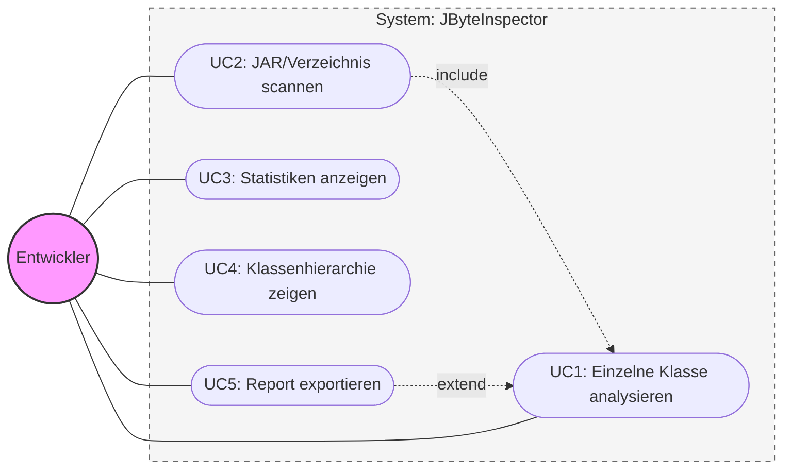

```mermaid
graph LR
    %% Akteur
    User((Entwickler))

    subgraph JByteInspector [System: JByteInspector]
        UC1([UC1: Einzelne Klasse analysieren])
        UC2([UC2: JAR/Verzeichnis scannen])
        UC3([UC3: Statistiken anzeigen])
        UC4([UC4: Klassenhierarchie zeigen])
        UC5([UC5: Report exportieren])
        
        %% Beziehungen innerhalb des Systems
        UC2 -.->|include| UC1
        UC5 -.->|extend| UC1
    end

    %% Verbindungen vom Akteur zu den Use Cases
    User --- UC1
    User --- UC2
    User --- UC3
    User --- UC4
    User --- UC5

    %% Styling für die Optik
    style User fill:#f9f,stroke:#333,stroke-width:2px
    style JByteInspector fill:#f5f5f5,stroke:#666,stroke-dasharray: 5 5
```

