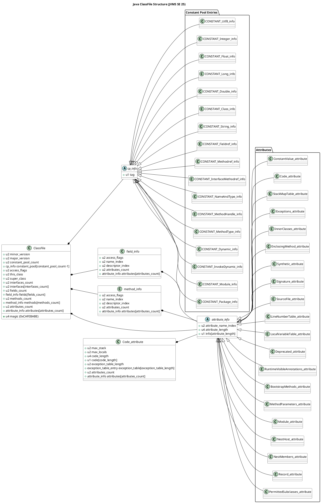

# ClassFile Struktur

```plantuml
@startuml  
title Java ClassFile Structure (JVMS SE 25)  
left to right direction  
  
skinparam class {  
    BackgroundColor White  
    ArrowColor Black  
    BorderColor Black  
}  
  
' Grundlegende ClassFile Struktur  
class ClassFile {  
    +u4 magic (0xCAFEBABE)  
    +u2 minor_version  
    +u2 major_version  
    +u2 constant_pool_count  
    +cp_info constant_pool[constant_pool_count-1]  
    +u2 access_flags  
    +u2 this_class  
    +u2 super_class  
    +u2 interfaces_count  
    +u2 interfaces[interfaces_count]  
    +u2 fields_count  
    +field_info fields[fields_count]  
    +u2 methods_count  
    +method_info methods[methods_count]  
    +u2 attributes_count  
    +attribute_info attributes[attributes_count]  
}  
  
' Definition der Hauptkomponenten  
abstract class cp_info {  
    +u1 tag  
}  
  
class field_info {  
    +u2 access_flags  
    +u2 name_index  
    +u2 descriptor_index  
    +u2 attributes_count  
    +attribute_info attributes[attributes_count]  
}  
  
class method_info {  
    +u2 access_flags  
    +u2 name_index  
    +u2 descriptor_index  
    +u2 attributes_count  
    +attribute_info attributes[attributes_count]  
}  
  
abstract class attribute_info {  
    +u2 attribute_name_index  
    +u4 attribute_length  
    +u1 info[attribute_length]  
}  
  
' Beziehungen  
ClassFile *-- cp_info  
ClassFile *-- field_info  
ClassFile *-- method_info  
ClassFile *-- attribute_info  
  
field_info *-- attribute_info  
method_info *-- attribute_info  
  
' Constant Pool Varianten (Auszug der wichtigsten)  
package "Constant Pool Entries" {  
  
  
    cp_info <|-down- CONSTANT_Utf8_info  
    cp_info <|-down- CONSTANT_Integer_info  
    cp_info <|-down- CONSTANT_Float_info  
    cp_info <|-down- CONSTANT_Long_info  
    cp_info <|-down- CONSTANT_Double_info  
    cp_info <|-down- CONSTANT_Class_info  
    cp_info <|-down- CONSTANT_String_info  
    cp_info <|-down- CONSTANT_Fieldref_info  
    cp_info <|-down- CONSTANT_Methodref_info  
    cp_info <|-down- CONSTANT_InterfaceMethodref_info  
    cp_info <|-down- CONSTANT_NameAndType_info  
    cp_info <|-down- CONSTANT_MethodHandle_info  
    cp_info <|-down- CONSTANT_MethodType_info  
    cp_info <|-down- CONSTANT_Dynamic_info  
    cp_info <|-down- CONSTANT_InvokeDynamic_info  
    cp_info <|-down- CONSTANT_Module_info  
    cp_info <|-down- CONSTANT_Package_info  
}  
  
' Attribute Varianten (Auszug gemäß JVMS 4.7)  
package "Attributes" {  
    attribute_info <|-- ConstantValue_attribute  
    attribute_info <|-- Code_attribute  
    attribute_info <|-- StackMapTable_attribute  
    attribute_info <|-- Exceptions_attribute  
    attribute_info <|-- InnerClasses_attribute  
    attribute_info <|-- EnclosingMethod_attribute  
    attribute_info <|-- Synthetic_attribute  
    attribute_info <|-- Signature_attribute  
    attribute_info <|-- SourceFile_attribute  
    attribute_info <|-- LineNumberTable_attribute  
    attribute_info <|-- LocalVariableTable_attribute  
    attribute_info <|-- Deprecated_attribute  
    attribute_info <|-- RuntimeVisibleAnnotations_attribute  
    attribute_info <|-- BootstrapMethods_attribute  
    attribute_info <|-- MethodParameters_attribute  
    attribute_info <|-- Module_attribute  
    attribute_info <|-- NestHost_attribute  
    attribute_info <|-- NestMembers_attribute  
    attribute_info <|-- Record_attribute  
    attribute_info <|-- PermittedSubclasses_attribute  
}  
  
' Spezielle Struktur für das Code-Attribut  
class Code_attribute {  
    +u2 max_stack  
    +u2 max_locals  
    +u4 code_length  
    +u1 code[code_length]  
    +u2 exception_table_length  
    +exception_table_entry exception_table[exception_table_length]  
    +u2 attributes_count  
    +attribute_info attributes[attributes_count]  
}  
Code_attribute *-- attribute_info  
  
@enduml
```
