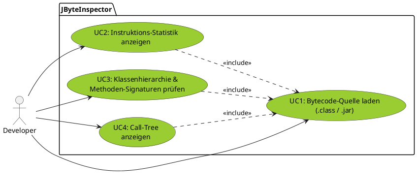

### US1: Flexibles Laden von Bytecode-Quellen (basierend auf UC1)
**Story:**
	Als **Entwickler** möchte ich **einzelne .class-Dateien, ganze Verzeichnisse oder .jar-Archive** in das Tool laden können, damit ich nicht jede Datei händisch einzeln spezifizieren muss und flexibel in der Analyse bin.
**Akzeptanzkriterien:**
	- Das Programm akzeptiert einen Dateipfad als Kommandozeilenargument oder Input.
	- Bei Angabe eines Verzeichnisses werden alle darin enthaltenen `.class`-Dateien rekusiv gefunden.
	- Inhalte von `.jar`-Archiven werden temporär entpackt oder via `ZipInputStream`direkt gelesen.
	- Bei ungültigen Dateiformaten (z.B. keine Java-Klasse) wird eine verständliche Fehlermeldung ausgegeben, statt abzustürzen.

### US2: Übersichtliche Instruktions-Statistik (basierend auf UC2)#
**Story:**
	 Als **Entwickler** möchte ich eine **zusammengefasste Statistik der Bytecode-Instruktionen** sehen, damit ich auf einem Blick erkenne, ob eine Klasse eher rechenintensiv (Math), logiklastig (Control Flow) oder anderweitig geprägt ist.
**Akzeptanzkriterien:**
	- Alle Opcodes einer Klasse werden gezählt.
	- Die Opcodes werden in sinnvolle Kategorien gruppiert
	- Die Ausgabe erfolgt in einer tabellarischen Übersicht (z.B. absolute Anzahl und prozentualer Anteil)
	- (Optional): Die Top-3 der am häufigsten verwendeten Befehle werden hervorgehoben.

### US3: Transparenz der Klassenhierarchie (basiert auf UC3)
**Story:**
	Als **Entwickler** möchte ich die **Vererbungslinie und die importierten Interfaces** einer kompilierten Klasse einsehen, um die strukturelle Einordnung der Klasse in einem fremden Projekt schnell zu verstehen.
**Akzeptanzkriterien:**
	- Der Name der Superklasse wird korrekt extrahiert.
	- Sämtliche direkt implementierten Interfaces werden aufgelistet.
	- Modifier der Klasse (z.B. `final`, `abstract`, `public`) werden im Klartext angezeigt.
	- Die Namen und Rückgabetypen aller deklarierten Methoden werden übersichtlich aufgelistet.

### US4: Visualisierung der Methoden-Abhängigkeiten (basiert auf UC4)
**Story:**
	Als **Entwickler** möchte ich sehen, welche externen Methoden von meiner Klasse aufgerufen werden (Call-Tree), damit ich verstehe, wie stark die Klasse mit anderen Komponenten des Systems gekoppelt ist.
**Akzeptanzkriterien:**
	- Alle INVOKEVIRTUAL-, INVOKESTATIC-, INVOKEINTERFACE- und INVOKESPECIAL- Befehle werden identifiziert.
	- Das System extrahiert Ziel-Klasse und Ziel-Methode jedes Aufrufs.
	- Die Liste der Abhängigkeiten wird ohne Duplikate ausgegeben (eindeutige Call-Graph)
	- Die Ausgabe unterscheidet zwischen Aufrufen innerhalb der eigenen Klasse und Aufrufen externen Bibliotheken (z.B. `java.lang.*`)